# AcuraQueue Hospital Management System 🏥⚡


> **AcuraQueue** is an enterprise-grade, AI-powered Smart Hospital Queue Management, Clinical Consultation, and Healthcare Administration System built using **FastAPI**, **SQLAlchemy**, **SQLite**, and **React (Vite)** with **Tailwind CSS**.

---

## 📌 Table of Contents

- [🌟 Project Overview](#-project-overview)
- [✨ Key Features](#-key-features)
- [🚀 Project Status](#-project-status)
- [🛠️ Technology Stack](#️-technology-stack)
- [🏗️ Project Architecture](#️-project-architecture)
- [📁 Repository Structure](#-repository-structure)
- [⚡ Installation & Setup Guide](#-installation--setup-guide)
- [👥 Usage Guide by Role](#-usage-guide-by-role)
- [🖼️ System Screenshots](#️-system-screenshots)
- [🔮 Realistic Future Improvements](#-realistic-future-improvements)
- [👥 Contributors](#-contributors)
- [📜 License](#-license)

---

## 🌟 Project Overview

**AcuraQueue** transforms hospital clinical workflows by providing a seamless multi-role portal for **Patients**, **Receptionists**, **Doctors**, and **Administrators**. The platform bridges real-time patient queue management, automated appointment scheduling, AI-assisted disease risk prediction, digital consultation records, e-prescriptions, lab orders, PDF report generation, and full-fledged hospital administration (Doctor, Receptionist, Department, User & Role Management, and System Settings).

### Key System Objectives:
- **Minimize Patient Wait Times**: Dynamic queue token generation, priority routing, emergency queue boosting, and real-time status updates over WebSockets.
- **Empower Physicians**: AI-driven clinical decision support (symptom prediction, risk assessment, care plan suggestions), structured consultation workflows, digital prescriptions, lab orders, and PDF export.
- **Streamline Front-Desk Operations**: Searchable patient registry, instant walk-in/scheduled check-in, real-time ticket counters, and appointment scheduling.
- **Full Operational Governance**: Executive Admin Dashboard featuring real-time KPIs, department analytics, role-based user management, staff management, and system-wide setting configuration.

---

## ✨ Key Features

### 🔐 1. Authentication & Authorization
- **JWT-Based Authentication**: Secure access tokens with role payload and expiration.
- **Role-Based Access Control (RBAC)**: Strict role enforcement (`Admin`, `Doctor`, `Receptionist`, `Patient`) protecting backend routes and frontend UI elements.
- **Password Security**: Passlib with bcrypt hashing and strength validation.

### 👤 2. Patient Management & Portal
- **Patient Registration**: Detailed demographic capture (Patient Code `PAT-XXXXXX`, Age, Gender, Contact, Address, Medical History, Allergies).
- **Patient Portal**: Personalized dashboard displaying appointment history, queue status, active prescriptions, medical reports, health score trends, and AI risk alerts.
- **Self-Service AI Assistant**: Interactive symptom checker and health assessment tools.

### 📋 3. Receptionist Module & Queue Management
- **Token Generation**: Automated queue token generation (e.g., `G-101`, `CARD-102`, `EMERG-001`).
- **Check-in Workflow**: Fast check-in for walk-in and pre-scheduled appointment patients.
- **Priority Handling**: Multi-tier priority routing (Normal, Urgent, Emergency).
- **Queue Live Counter**: Interactive ticket caller, status toggling (`Waiting`, `Calling`, `Completed`, `Cancelled`), and live WebSocket broadcasts.

### 🩺 4. Doctor Module & Clinical Workspace
- **Physician Dashboard**: Today's patient queue, active consultation callouts, and appointment roster.
- **Structured Consultation Workspace**: Chief complaints, vitals recording (BP, Pulse, Temp, SpO2, Weight), diagnosis entry, doctor notes, and follow-up date tracking.
- **E-Prescriptions**: Multi-item prescription writer with drug name, dosage, frequency, duration, and instructions.
- **Lab Orders**: Digital laboratory test ordering and tracking.
- **PDF Report Generation**: Automated PDF clinical summary export with download links.

### 🧠 5. AI Features & Decision Support
- **Disease Prediction Engine**: ML-based symptom assessment and risk scoring.
- **AI Clinical Recommendation Panel**: Real-time diagnostic suggestions, recommended lab tests, and care plan templates.
- **Confidence Threshold Guardrails**: Configurable confidence threshold (50%–99%) for physician safety.

### 🏢 6. Administration & Staff Management
- **Executive Admin Dashboard**: Real-time KPIs (Total Patients, Total Doctors, Total Receptionists, Total Departments, Active Queue Count, Today's Appointments).
- **Doctor Management**: Full CRUD, schedule configuration (working days, hours, consultation duration), availability toggle, active queue safeguards.
- **Receptionist Management**: Full CRUD, active roster management, admin password reset, soft disable/enable.
- **Department Management**: Full CRUD for clinical departments, assigned doctor tracking, and assigned-doctor deletion safeguards.
- **User & Role Management**: Centralized user account directory, multi-role assignment, automatic profile creation, and linked record synchronization.
- **System Settings**: Global hospital profile configuration, appointment policies, queue prefixes, notification dispatch, AI parameters, localization, and appearance preferences.

---

## 🚀 Project Status

| Metric | Status |
| :--- | :--- |
| **Current Version** | `v2.0.0` (Production Ready) |
| **Backend Test Suite Pass Rate** | **100%** (Automated Python Verification) |
| **Frontend Production Build** | **PASSED** (8.12s build time) |
| **API Endpoints Coverage** | 100% Documented |
| **Database Migrations** | Automatic SQLite column auto-backfill on boot |

---

## 🛠️ Technology Stack

| Domain | Technology | Purpose |
| :--- | :--- | :--- |
| **Backend Framework** | **FastAPI** | High-performance Python async REST API server |
| **Database** | **SQLite** / **SQLAlchemy** | Relational Database & ORM mapping |
| **Authentication** | **OAuth2 / JWT** + **Passlib (bcrypt)** | Secure token authentication & password hashing |
| **PDF Generation** | **ReportLab** | Server-side PDF report rendering |
| **Real-time** | **WebSockets** | Instant queue ticket and notification broadcasting |
| **Frontend Framework** | **React 18 (Vite)** | Single Page Application (SPA) framework |
| **Styling & Design** | **Tailwind CSS** + **Lucide Icons** | Vibrant responsive UI & micro-animations |
| **Charts & Analytics** | **Recharts** | Executive dashboard data visualization |
| **HTTP Client** | **Axios** | Backend REST API integration |

---

## 🏗️ Project Architecture

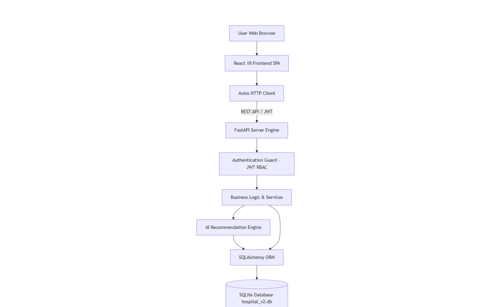

```
[ Client Browser (React SPA) ]
            │
    HTTP / REST & WebSockets
            │
            ▼
[ FastAPI Application Server ]
    ├── CORS Middleware & Auth Guard (JWT RBAC)
    ├── REST Routers (/api/auth, /api/queue, /api/clinical, /api/doctors, etc.)
    ├── ReportLab PDF Generator & WebSocket Manager
    └── SQLAlchemy ORM Layer
            │
            ▼
  [ SQLite Database (hospital_v2.db) ]
```

Detailed architectural blueprints are documented in [docs/02_System_Architecture.md](file:///d:/disease-prediction-/docs/02_System_Architecture.md).

---

## 📁 Repository Structure

```
disease-prediction/
├── backend/
│   ├── database/
│   │   ├── connection.py        # Database engine & session setup
│   │   ├── models.py            # SQLAlchemy models (User, Doctor, Patient, Department, Queue, etc.)
│   │   └── schemas.py           # Pydantic validation schemas
│   ├── routes/                  # API Routers (auth, doctor, receptionist, department, user_management, etc.)
│   ├── services/                # Auth, PDF Report Generator, Queue logic
│   ├── utils/                   # WebSocket manager & helper utilities
│   └── main.py                  # FastAPI application entrypoint & SQLite auto-migrations
│
├── frontend/
│   ├── src/
│   │   ├── components/          # Reusable UI modules (DoctorManagement, SystemSettings, etc.)
│   │   ├── pages/               # Workspace pages (AdminDashboard, DoctorDashboard, etc.)
│   │   ├── services/            # Axios API services (api.js)
│   │   └── App.jsx              # Main router & state context
│   ├── package.json
│   └── vite.config.js
│
├── docs/                        # Complete technical documentation package
│   ├── diagrams/                # Draw.io XML architectural & ER diagrams
│   ├── screenshots/             # Interface reference screenshots
│   ├── 01_Project_Overview.md
│   ├── 02_System_Architecture.md
│   ├── 03_Database_Design.md
│   ├── 04_API_Documentation.md
│   ├── 05_User_Manual.md
│   ├── 06_Admin_Manual.md
│   ├── 07_Test_Report.md
│   ├── 08_Project_Structure.md
│   └── 09_Future_Enhancements.md
└── LICENSE                      # MIT License
```

---

## ⚡ Installation & Setup Guide

### Prerequisites
- **Python 3.10+**
- **Node.js 18+** & `npm`

### 1. Backend Setup

```bash
# Clone the repository
git clone https://github.com/MohdBaasil/disease-prediction-.git
cd disease-prediction-

# Create virtual environment (optional but recommended)
python -m venv venv
# On Windows:
venv\Scripts\activate

# Install dependencies
pip install fastapi uvicorn sqlalchemy pydantic passlib python-jose reportlab jinja2

# Run FastAPI backend server
python -m uvicorn backend.main:app --reload --port 8000
```

The backend server will run at `http://localhost:8000`. Interactive API Documentation is available at `http://localhost:8000/docs`.

### 2. Frontend Setup

```bash
# Navigate to frontend directory
cd frontend

# Install Node dependencies
npm install

# Run Vite dev server
npm run dev
```

The frontend application will run at `http://localhost:5173`.

---

## 👥 Usage Guide by Role

### 1. 🛡️ Administrator (`Admin`)
- **Dashboard**: View executive KPIs, monthly registration charts, and active queue distribution.
- **Doctor Management**: Create doctor accounts, set department, assign working hours, and toggle status.
- **Receptionist Management**: Manage reception staff rosters and reset passwords.
- **Department Management**: Add/edit medical departments (Cardiology, Neurology, Pediatrics, etc.).
- **User & Role Management**: View user directory, update user roles, and trigger soft status toggles.
- **System Settings**: Configure hospital profile, appointment booking rules, queue prefixes, and AI confidence thresholds.

### 2. 📋 Receptionist (`Receptionist`)
- **Patient Registration**: Register new patients with demographic details.
- **Queue Check-In**: Check-in patients for walk-in or scheduled appointments, assigning department and priority level.
- **Live Ticket Counter**: Call tickets, update statuses, and monitor room queues.

### 3. 👨‍⚕️ Doctor (`Doctor`)
- **Physician Workspace**: View current waiting queue, call next patient into consultation room.
- **Clinical Encounter**: Record vitals, diagnosis, doctor notes, e-prescriptions, and lab orders.
- **AI Decision Support**: View AI diagnostic recommendations and care plan templates.
- **Report Generation**: Export signed clinical summary PDFs.

### 4. 👤 Patient (`Patient`)
- **Patient Portal**: View appointment schedules, queue token status, prescription details, and medical reports.
- **AI Health Assistant**: Self-check symptoms and review health score trends.

---

## 🖼️ System Screenshots

| Screen Interface | Screenshot Reference |
| :--- | :--- |
| **Authentication Login** | 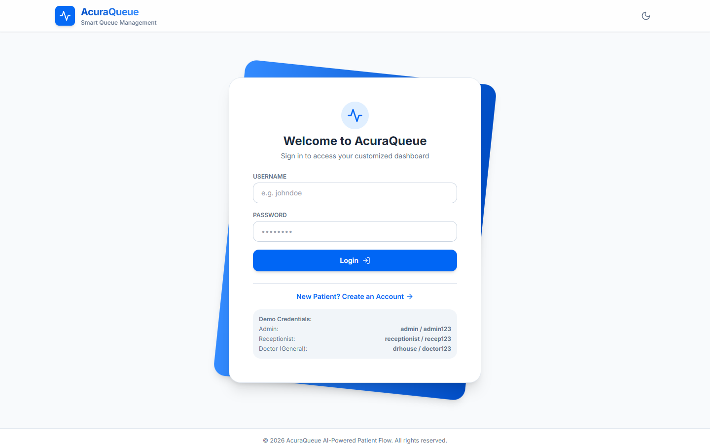 |
| **Executive Admin Dashboard** | 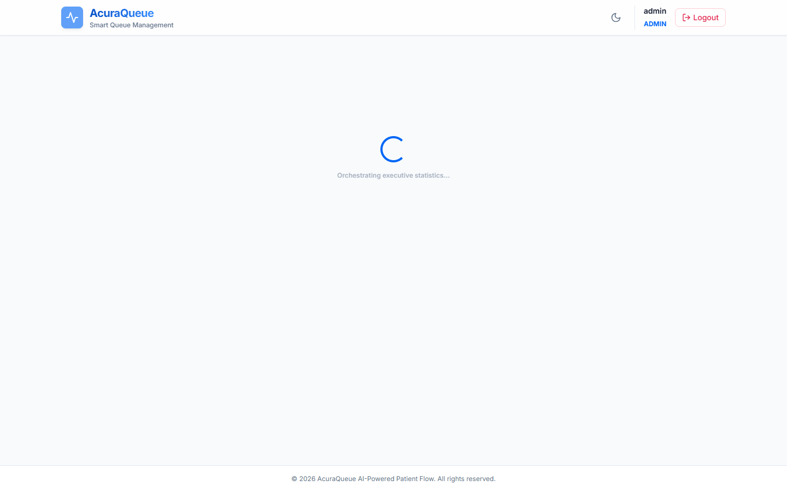 |
| **Doctor Dashboard & Workload** |  |
| **Receptionist Dashboard** |  |
| **Patient Registration Modal** | 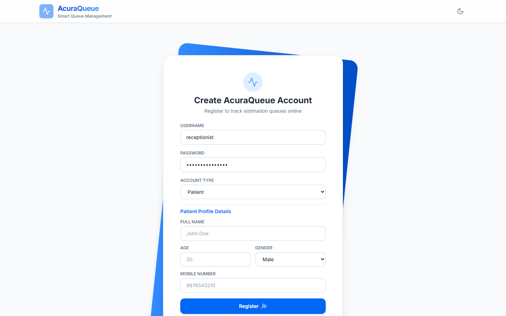 |
| **Appointment Booking Modal** | 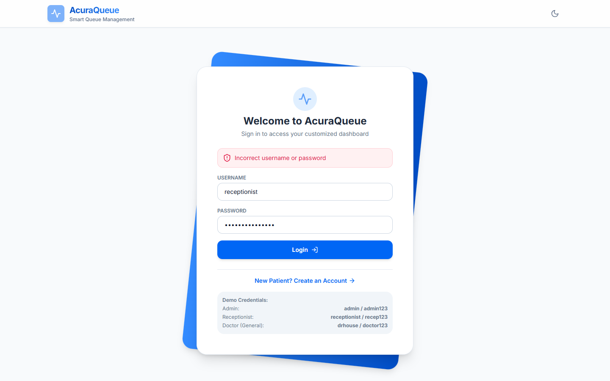 |
| **Queue Ticket Management** | 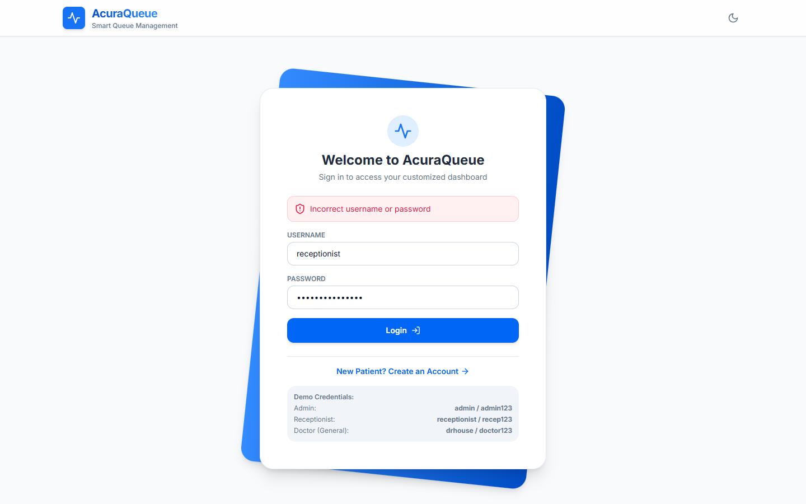 |
| **Doctor Consultation Encounter** | 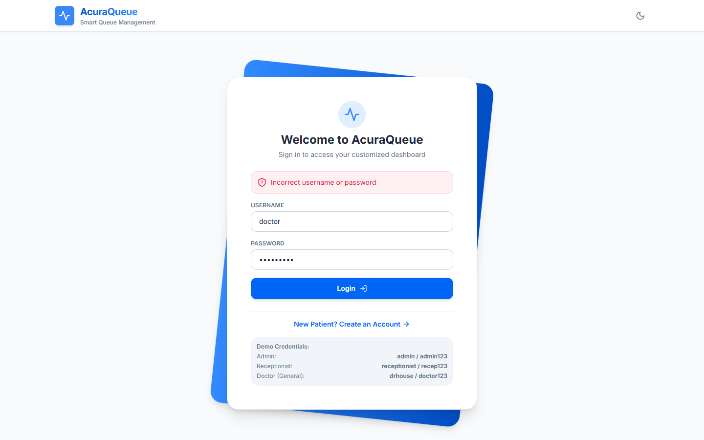 |
| **E-Prescription Module** |  |
| **Laboratory Test Orders** | 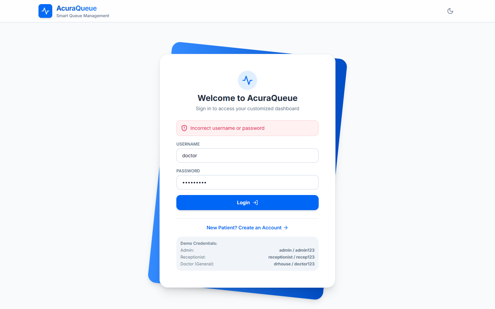 |
| **Doctor Management Module** | 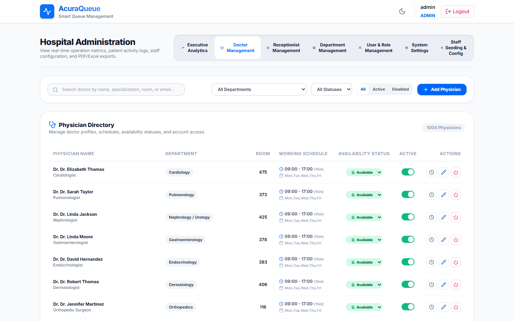 |
| **Department Management Module** | 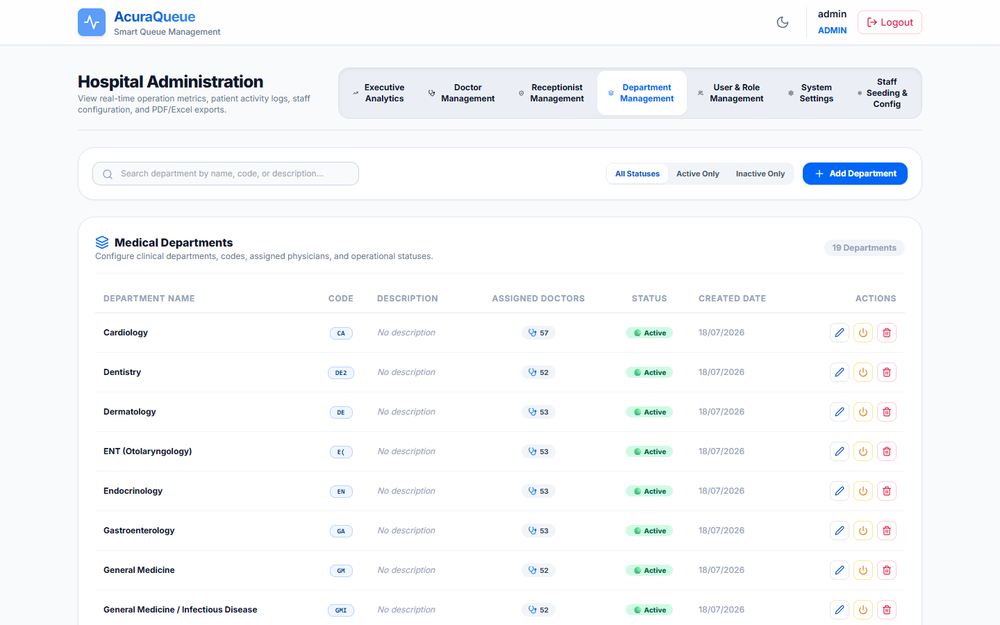 |
| **Receptionist Management Module** | 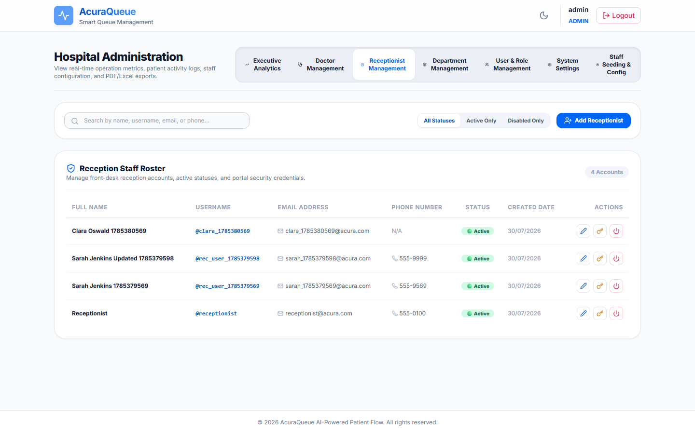 |
| **User & Role Management Module** | 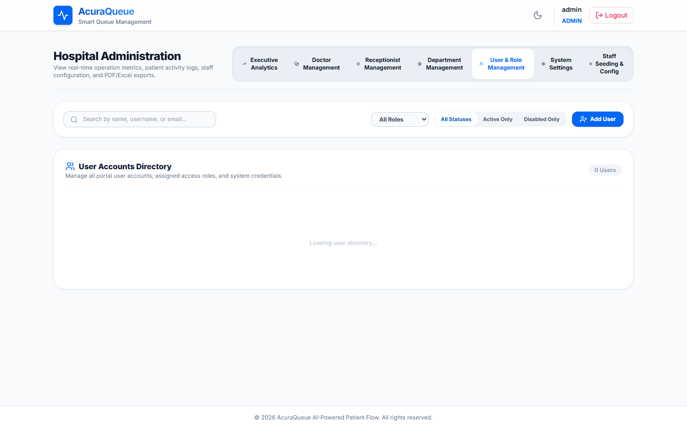 |
| **System Settings Module** | 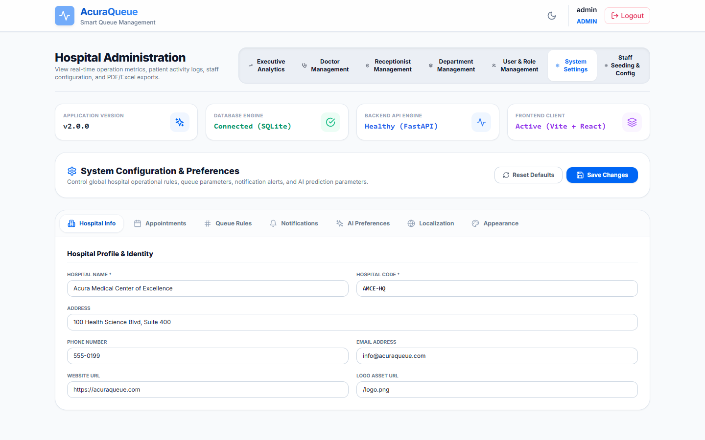 |

---

## 🔮 Realistic Future Improvements

- **PostgreSQL Database Migration**: Upgrade from SQLite to PostgreSQL for high-concurrency production deployments.
- **Docker Containerization**: Add `docker-compose.yml` for unified multi-container deployment.
- **SMS & Email Gateway Integration**: Connect Twilio / SendGrid for automated appointment reminders.
- **Redis Caching**: Cache active department lists and frequent analytics endpoints.

---

## 👥 Contributors

- **Mohd Baasil** - *Lead Architect & Full Stack Engineer* - [GitHub Profile](https://github.com/MohdBaasil)
- **AcuraQueue Development Team**

---

## 📜 License

This project is licensed under the **MIT License**. See the [LICENSE](LICENSE) file for details.
