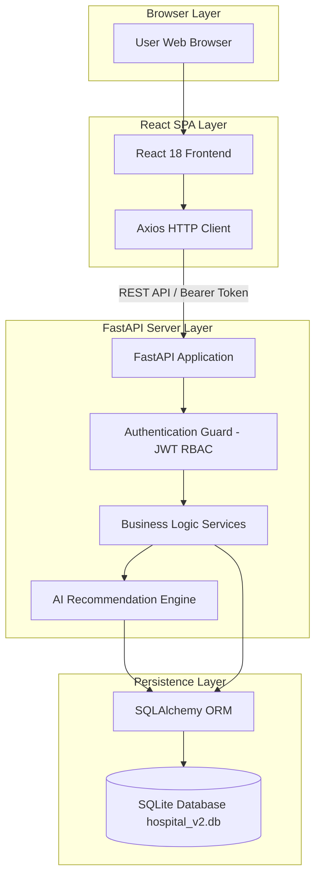

# System Architecture: AcuraQueue Hospital Management System

---

## 🏛️ 1. Overall System Architecture

The **AcuraQueue Hospital Management System** follows a modern, decoupled **Client-Server Architecture** comprising a single-page React frontend, a high-performance FastAPI backend, and an ORM-backed relational database layer.

### End-to-End Request Processing Flow:

```
[ Browser ]
    │
    ▼
[ React Frontend ] (Vite SPA)
    │
    ▼
[ Axios Client ] (JWT Header Injection)
    │
    ▼
[ FastAPI Server ] (CORS Middleware)
    │
    ▼
[ Authentication ] (OAuth2 / RoleChecker RBAC)
    │
    ▼
[ Business Logic Services ] (Queue Engine / PDF Generator)
    │
    ▼
[ AI Module ] (Disease Risk & Symptom Recommendation)
    │
    ▼
[ SQLAlchemy ORM ] (Relational Mapping)
    │
    ▼
[ SQLite Database ] (hospital_v2.db)
```

---

## 💻 2. Frontend Architecture (React + Vite)

The frontend is engineered as a responsive Single Page Application (SPA) powered by **React 18** and **Vite**, structured around component reusability and modular page layouts.

### Key Frontend Layers:
- **Layout Shells**: Role-specific layouts (`AdminDashboard`, `DoctorDashboard`, `ReceptionistDashboard`, `PatientDashboard`) containing global sidebars, topbars, theme toggles, and user menus.
- **Service Abstraction (`src/services/api.js`)**: Encapsulates all backend REST calls using an Axios instance configured with automatic JWT authorization header injection (`Authorization: Bearer <token>`) and response interceptors.
- **Management Components**: Self-contained administrative modules (`DoctorManagement.jsx`, `ReceptionistManagement.jsx`, `DepartmentManagement.jsx`, `UserManagement.jsx`, `SystemSettings.jsx`).

---

## ⚙️ 3. Backend Architecture (FastAPI + SQLAlchemy)

The backend is built with **FastAPI**, exploiting Python's `async/await` features and Pydantic data validation schemas.

### Architecture Highlights:
- **Modular Routing (`backend/routes/`)**: Features dedicated router modules for `auth`, `doctor`, `receptionist`, `department`, `user_management`, `settings`, `queue`, `clinical`, `appointments`, `ai`, and `dashboard`.
- **Auto-Migrations (`migrate_db()`)**: Inspects SQLite database table schemas on server boot and applies required column additions automatically.
- **WebSocket Broadcast Manager (`backend/utils/websocket.py`)**: Maintains active client connections and broadcasts live queue ticket calls across reception and doctor dashboards.
- **Server-Side PDF Service (`backend/services/pdf_report_service.py`)**: Uses ReportLab to generate branded clinical summary PDFs containing patient vitals, diagnosis, prescriptions, and lab orders.

---

## 🔐 4. Authentication & Authorization Flow

AcuraQueue implements a stateless **JSON Web Token (JWT)** authentication model:

```
[ User ] ──── 1. POST /api/auth/login {username, password} ───► [ Auth Router ]
                                                                       │
                                                            Verify Bcrypt Password
                                                                       │
[ User ] ◄─── 2. Returns {access_token, token_type, role} ─────────────┘
   │
   ├─── 3. Subsequent Requests Header: "Authorization: Bearer <token>" ───► [ RoleChecker Guard ]
                                                                                │
                                                                       Validate Role & Expiry
                                                                                │
                                                                        [ Process Request ]
```

---

## 📊 5. Mermaid Architecture Diagram



---

## 🎨 6. System Architecture Diagram (PNG & Draw.io XML)


- **Editable Draw.io XML File**: [docs/diagrams/architecture.drawio.xml](file:///d:/disease-prediction-/docs/diagrams/architecture.drawio.xml)
- **High-Resolution PNG Export**: [docs/diagrams/architecture.png](file:///d:/disease-prediction-/docs/diagrams/architecture.png)
