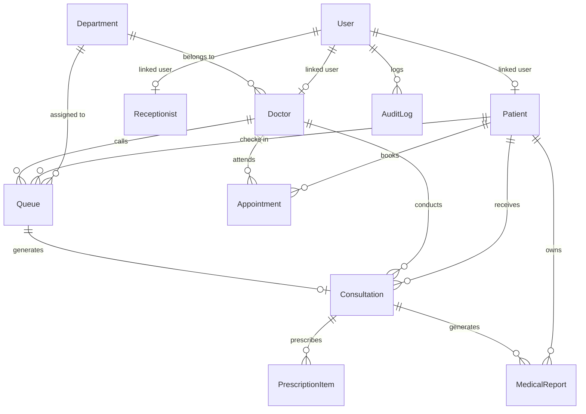
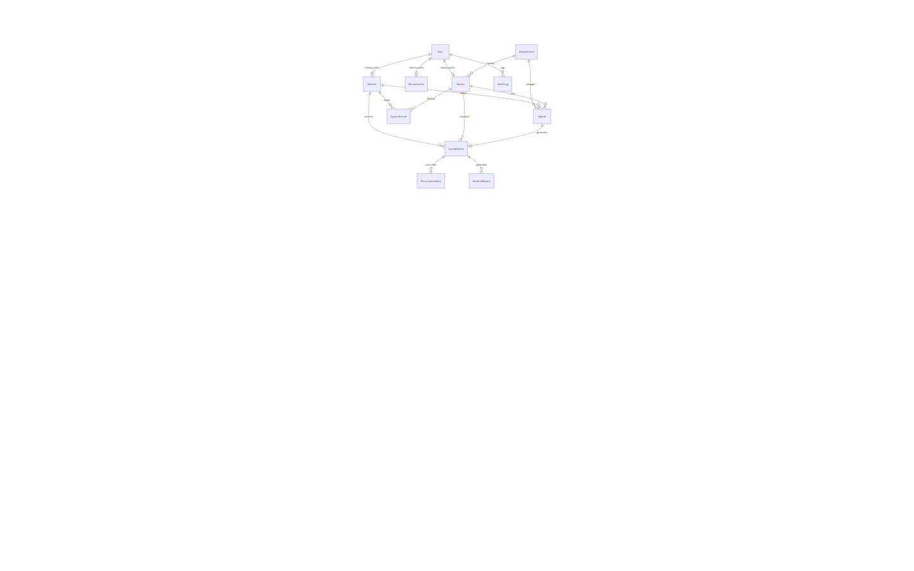

# Database Design: AcuraQueue Hospital Management System

---

## 🗄️ 1. Database Overview

The **AcuraQueue** database layer is powered by **SQLAlchemy ORM** mapping onto an **SQLite** database (`hospital_v2.db`). The schema comprises 18 relational tables designed with strict foreign key constraints, unique indexing, and automated cascading cleanup.

---

## 📋 2. Detailed Model Specifications

### 1. `users` (User Account Registry)
- **Purpose**: Stores all system user credentials and authorization roles.
- **Primary Key**: `id` (Integer)
- **Columns**: `username` (VARCHAR, UNIQUE), `hashed_password` (VARCHAR), `role` (VARCHAR: Admin, Doctor, Receptionist, Patient), `email` (VARCHAR, UNIQUE), `is_active` (BOOLEAN, Default True), `created_at` (DATETIME), `updated_at` (DATETIME), `last_login` (DATETIME).

### 2. `departments` (Clinical Department Roster)
- **Purpose**: Medical specialty departments (e.g. General Medicine, Cardiology).
- **Primary Key**: `id` (Integer)
- **Columns**: `name` (VARCHAR, UNIQUE), `code` (VARCHAR, UNIQUE), `description` (TEXT), `is_active` (BOOLEAN, Default True), `created_at` (DATETIME), `updated_at` (DATETIME).

### 3. `doctors` (Physician Profile Roster)
- **Purpose**: Detailed doctor profile and schedule metadata.
- **Primary Key**: `id` (Integer)
- **Foreign Keys**: `user_id` -> `users.id` (CASCADE), `department_id` -> `departments.id` (SET NULL).
- **Columns**: `name` (VARCHAR), `specialization` (VARCHAR), `room_number` (VARCHAR), `email` (VARCHAR), `is_active` (BOOLEAN), `is_available` (BOOLEAN), `status_text` (VARCHAR), `working_days` (VARCHAR), `working_hours_start` (VARCHAR), `working_hours_end` (VARCHAR), `avg_consultation_time` (INTEGER).

### 4. `receptionists` (Reception Staff Roster)
- **Purpose**: Receptionist profile information.
- **Primary Key**: `id` (Integer)
- **Foreign Key**: `user_id` -> `users.id` (CASCADE).
- **Columns**: `name` (VARCHAR), `email` (VARCHAR), `phone` (VARCHAR), `is_active` (BOOLEAN), `created_at` (DATETIME), `updated_at` (DATETIME), `last_login` (DATETIME).

### 5. `patients` (Patient Demographic Registry)
- **Purpose**: Stores patient demographics, medical background, and contact details.
- **Primary Key**: `id` (Integer)
- **Foreign Key**: `user_id` -> `users.id` (SET NULL).
- **Columns**: `name` (VARCHAR), `age` (INTEGER), `gender` (VARCHAR), `contact_number` (VARCHAR), `email` (VARCHAR), `address` (TEXT), `medical_history` (TEXT), `allergies` (TEXT), `patient_code` (VARCHAR, UNIQUE), `blood_group` (VARCHAR).

### 6. `appointments` (Scheduled & Walk-In Appointments)
- **Purpose**: Tracks patient appointments with doctors.
- **Primary Key**: `id` (Integer)
- **Foreign Keys**: `patient_id` -> `patients.id`, `doctor_id` -> `doctors.id`.
- **Columns**: `appointment_time` (DATETIME), `status` (VARCHAR: Scheduled, Checked-In, Completed, Cancelled), `appointment_type` (VARCHAR), `priority_level` (INTEGER).

### 7. `queues` (Live Patient Queue Tickets)
- **Purpose**: Real-time patient queue tickets.
- **Primary Key**: `id` (Integer)
- **Foreign Keys**: `patient_id` -> `patients.id`, `department_id` -> `departments.id`, `doctor_id` -> `doctors.id`.
- **Columns**: `token_number` (VARCHAR), `status` (VARCHAR: Waiting, Calling, Completed, Cancelled), `priority_level` (INTEGER).

### 8. `consultations` (Clinical Encounters)
- **Purpose**: Physician consultation records.
- **Primary Key**: `id` (Integer)
- **Foreign Keys**: `patient_id` -> `patients.id`, `doctor_id` -> `doctors.id`, `queue_id` -> `queues.id`.
- **Columns**: `chief_complaint` (TEXT), `vital_bp` (VARCHAR), `vital_pulse` (INTEGER), `vital_temp` (FLOAT), `vital_spo2` (FLOAT), `vital_weight` (FLOAT), `diagnosis` (TEXT), `doctor_notes` (TEXT), `follow_up_date` (DATETIME).

### 9. `prescription_items` (E-Prescription Items)
- **Purpose**: Individual prescription medications linked to a consultation.
- **Primary Key**: `id` (Integer)
- **Foreign Key**: `visit_id` -> `consultations.id` (CASCADE).
- **Columns**: `medicine_name`, `dosage`, `frequency`, `duration`, `instructions`.

### 10. `medical_reports` (Medical Documents)
- **Purpose**: Uploaded or generated clinical PDF reports.
- **Primary Key**: `id` (Integer)
- **Foreign Keys**: `patient_id` -> `patients.id`, `visit_id` -> `consultations.id`.

### 11. `system_settings` (Global Configuration)
- **Purpose**: Central hospital configuration, queue rules, AI threshold, localization, and appearance preferences.
- **Primary Key**: `id` (Integer)
- **Columns**: `hospital_name`, `hospital_code`, `appointment_duration_minutes`, `queue_prefix`, `ai_confidence_threshold`, `system_theme`, `primary_color`.

### 12. `audit_logs` (System Action Audit Trail)
- **Purpose**: Records administrative and system action logs.
- **Primary Key**: `id` (Integer)
- **Foreign Key**: `user_id` -> `users.id`.

---

## 🧜‍♂️ 3. Entity Relationship Diagram (Mermaid)

---

## 🎨 4. Entity Relationship Diagram (PNG & Draw.io XML)

- **Editable Draw.io XML File**: [docs/diagrams/database_er.drawio.xml](file:///d:/disease-prediction-/docs/diagrams/database_er.drawio.xml)
- **High-Resolution PNG Export**: [docs/diagrams/database_er.png](file:///d:/disease-prediction-/docs/diagrams/database_er.png)
